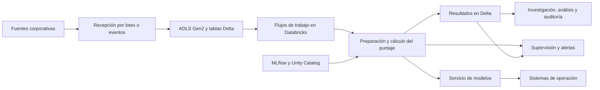

# Modelo de fraude en Azure Databricks

Este repositorio reúne el trabajo realizado para llevar un modelo de detección de fraude desde el entrenamiento hasta su uso controlado en Azure Databricks.

El modelo asigna un puntaje de riesgo a cada reclamación. Su propósito es ordenar los casos que deben revisar los investigadores; no reemplaza el análisis humano ni confirma por sí solo la existencia de fraude.

## Alcance

La solución comprende:

- recepción de reclamaciones históricas y nuevas mediante tablas Delta;
- preparación de variables y comparación de modelos con PySpark;
- registro del modelo y de sus resultados con MLflow y Unity Catalog;
- cálculo periódico de puntajes para grandes grupos de reclamaciones;
- almacenamiento de resultados y datos de auditoría en tablas Delta;
- propuesta de un servicio en línea para decisiones que requieren respuesta inmediata;
- controles para aprobar una nueva versión y regresar a la anterior cuando sea necesario;
- supervisión de ejecuciones, calidad de datos, cambios de distribución y desempeño del modelo.

## Arquitectura



Los servicios concretos pueden variar según el entorno. El diseño separa las fuentes, el almacenamiento, el cálculo del puntaje, el consumo, la seguridad y la supervisión.

## Resultados

| Indicador | Resultado |
| --- | ---: |
| Modelo seleccionado | Bosque aleatorio |
| Área bajo la curva ROC | 0.7851 |
| Área bajo la curva de precisión y exhaustividad | 0.6128 |
| Fraudes encontrados en el 20 % de casos con mayor puntaje | 41.8 % |
| Semilla utilizada | 42 |

Los archivos de [evidencias/resultados](evidencias/resultados) contienen resultados agrupados. No se publican datos que permitan identificar reclamaciones o asegurados.

## Contenido del repositorio

```text
.
|-- config/
|   `-- parametros_ejemplo.yml
|-- data/
|   |-- README.md
|   `-- raw/                         # Datos locales excluidos de Git
|-- entregables/
|   `-- presentacion_prueba_tecnica_mlops.pptx
|-- evidencias/
|   |-- notebooks_html/             # Ejecuciones completas en formato HTML
|   `-- resultados/                 # Resultados agrupados
|-- notebooks/                      # Cuadernos ejecutados en Databricks
|-- scripts/
|   `-- validar_repositorio.py
|-- src/databricks/                 # Código fuente para Databricks
|-- requirements.txt
`-- README.md
```

## Etapas desarrolladas

| Orden | Etapa | Propósito |
| ---: | --- | --- |
| 00 | Simulación de reclamaciones | Genera casos nuevos para comprobar el tratamiento incremental y la repetición segura del proceso. |
| 01 | Entrenamiento y registro | Prepara las variables, compara modelos, registra resultados y publica la versión aprobada. |
| 02 | Cálculo por lotes | Identifica registros nuevos, aplica el modelo y guarda los resultados sin duplicarlos. |
| 03 | Validación del servicio | Revisa el artefacto del modelo y su contrato de entrada y salida. |
| 04 | Gobierno del modelo | Documenta la reproducción, los controles, la aprobación y la reversión de versiones. |
| 05 | Supervisión | Analiza cambios en los datos y puntajes, y establece cuándo corresponde realizar un nuevo entrenamiento. |
| 06 | Consumo por lotes y mediante API | Compara las dos formas de consumo y define un contrato común. |

Cada etapa se presenta de tres maneras:

- `notebooks/*.ipynb`: cuadernos descargados desde Databricks con sus resultados;
- `src/databricks/*.py`: código fuente preparado para revisión y control de versiones;
- `evidencias/notebooks_html/*.html`: copia completa de cada ejecución para consulta sin acceso a Databricks.

## Ejecución

La solución requiere un espacio de trabajo de Databricks con Unity Catalog. Spark y Delta forman parte del entorno de ejecución; `requirements.txt` incluye las bibliotecas adicionales utilizadas por los cuadernos.

1. Crear o adaptar el catálogo y el esquema de trabajo.
2. Cargar una muestra anónima en una tabla Delta.
3. Revisar [config/parametros_ejemplo.yml](config/parametros_ejemplo.yml).
4. Importar los archivos de `src/databricks/` o los cuadernos de `notebooks/`.
5. Ejecutar las etapas en orden, del `00` al `06`. La etapa `00` se utiliza únicamente para la demostración.

La estructura del repositorio puede comprobarse con:

```bash
python scripts/validar_repositorio.py
```

## Decisiones principales

### Versión aprobada

Los procesos consumidores consultan `models:/<modelo>@Champion`. `Champion` es el nombre estable que señala la versión aprobada. Cuando se autoriza una versión nueva, se actualiza esa referencia sin cambiar el código de los consumidores.

Si la versión nueva presenta problemas, la referencia vuelve a la versión anterior. Las dos versiones permanecen registradas para conservar la auditoría.

### Procesamiento por lotes y servicio mediante API

El procesamiento diario por lotes es la opción principal para ordenar grandes cantidades de reclamaciones y preparar la cola de investigación. La API se reserva para situaciones en las que el sistema necesita el puntaje durante la transacción.

Las dos alternativas comparten el modelo aprobado, la preparación de variables, los límites de riesgo, el contrato de salida y los controles de seguridad.

### Nuevo entrenamiento

Un cambio en la distribución de los datos no conduce de manera automática a entrenar otra versión. Primero se revisan los datos, la versión utilizada, la ejecución y las reglas del negocio.

Se propone un nuevo entrenamiento cuando el cambio persiste y las etiquetas disponibles confirman una pérdida importante de desempeño, una modificación de la relación entre las variables y el fraude, o la aparición de una población que el modelo original no conocía.

## Seguridad y tratamiento de los datos

- El repositorio no contiene contraseñas, credenciales ni claves de acceso.
- Los enlaces internos, correos e identificadores de usuario fueron sustituidos por valores anónimos.
- La muestra original permanece en `data/raw/` y no se incorpora a Git.
- Los resultados publicados son agrupados.
- En un entorno real se utilizarían identidades administradas, Azure Key Vault, permisos de Unity Catalog y el principio de mínimo privilegio.

## Evidencias

- [Presentación final](entregables/presentacion_prueba_tecnica_mlops.pptx)
- [Ejecuciones en HTML](evidencias/notebooks_html)
- [Resultados agrupados](evidencias/resultados)

## Límites de la demostración

- La configuración de redes, identidades y recursos de Azure depende de las normas de cada organización.
- La etapa de servicio comprueba el artefacto y su contrato. La publicación del punto de acceso depende de la capacidad y los permisos disponibles en el espacio de trabajo.
- La ejecución original no registró una versión de Git en MLflow. El código fuente de este repositorio permite corregir esa falta en ejecuciones futuras.
